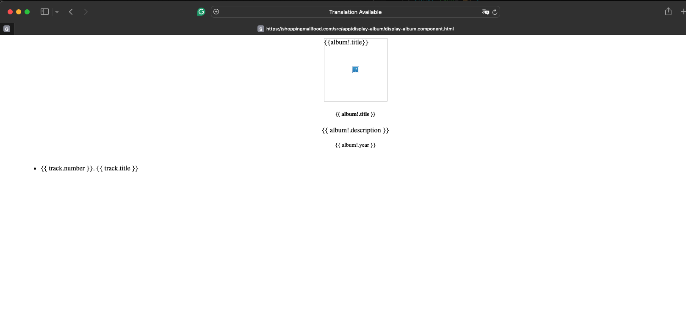

# Activity-4 Music App

## Executive Summary

- In this activity, we will develop the Music App by integrating it with the back-end services created in Topic 1. The app will utilize MAMP and Express to provide the necessary datasets.

# Research Questions:
1. How does an Angular application maintain a logged-in state?
2. How does an Angular application communicate this state to the server?

## An Angular application maintains a logged-in state and communicates with the server using various libraries and techniques:

1. RxJS Observables: This powerful library provides a reactive programming approach, allowing developers to create observables that represent streams of data. These observables can be combined, transformed, and subscribed to in different components to react to state changes.

2. Angular Services: Angular services are an effective method for managing state within an application. Once created and injected into components, services centralize state logic, making it accessible across multiple components.

3. NgRx: NgRx is a popular library for managing and maintaining state based on Redux principles. It offers a robust pattern for state management using actions, reducers, and selectors, centralizing state management in a store.

# To handle user authorization, HTTP requests and responses with cookies or tokens are used:

- HTTP Requests and Responses: When a user logs in, the server typically returns a token (e.g., JWT) or sets a cookie. This token or cookie is then included in subsequent HTTP requests to authenticate the user.

- Interceptors: Angular's HTTP interceptors can be used to automatically add the token or cookie to every HTTP request, ensuring that the server can verify the user's identity.

- Session Storage or Local Storage: The token or session information can be stored in the browser's session storage or local storage to persist the logged-in state across page reloads. Angular services can then access this stored information to manage the application state.

## By utilizing these methods or libraries, developers can effectively manage user state and securely communicate with the server in an Angular application.

#### Music App Screenshots:

- This is the main screen of Music App which Bootstrap was used to styling it. 

- This screen displays the list of artist in the database. My Angular is no longer working on my hostinger server.

- This screen displays the album list for artist. My Angular is no longer working on my hostinger server.

- This screen shows the page that edits album with rtucks.

- This screen shows the page that diaplay the album with rtucks.

- This screen shows the page that use to create a new album which by providing the album detials and cleck submit the new album will be added to album list.

- The tree screens above show the process of deleting an album from the database, which I create an album (for testing perpuse) and then by clicking the delete icon the album will be deleted and the message will be displayed.

**- Resorces:**

The Hero Editor - ts - TUTORIAL. https://v2.angular.io/docs/ts/latest/tutorial/toh-pt1.html

Angular tutorials and examples - Web Engineer Book. https://book.vipsprojects.com/pages/angular-extra.html

Angular - Simple deployment options - w3resource. https://www.w3resource.com/angular/deployment.php

https://www.youtube.com/watch?v=5rCh-Gdj1Uw

github: https://github.com/jinnoc/CST-391-.git
