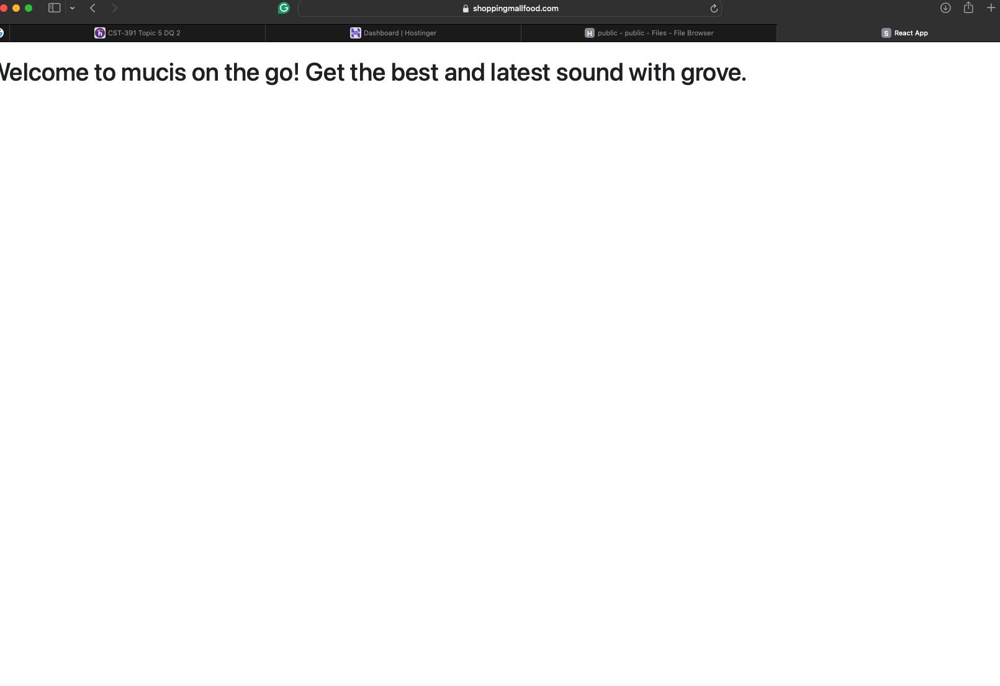
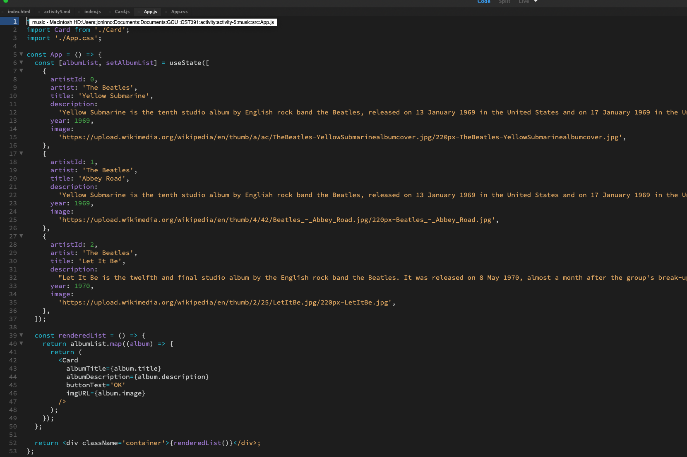
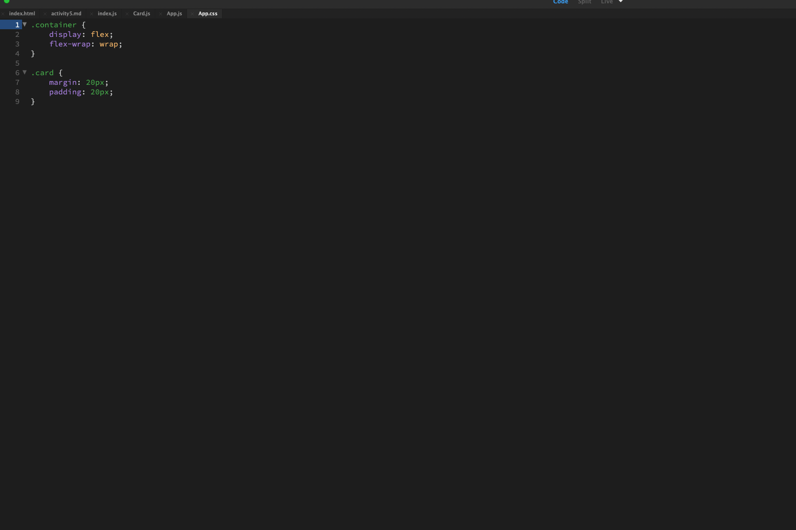
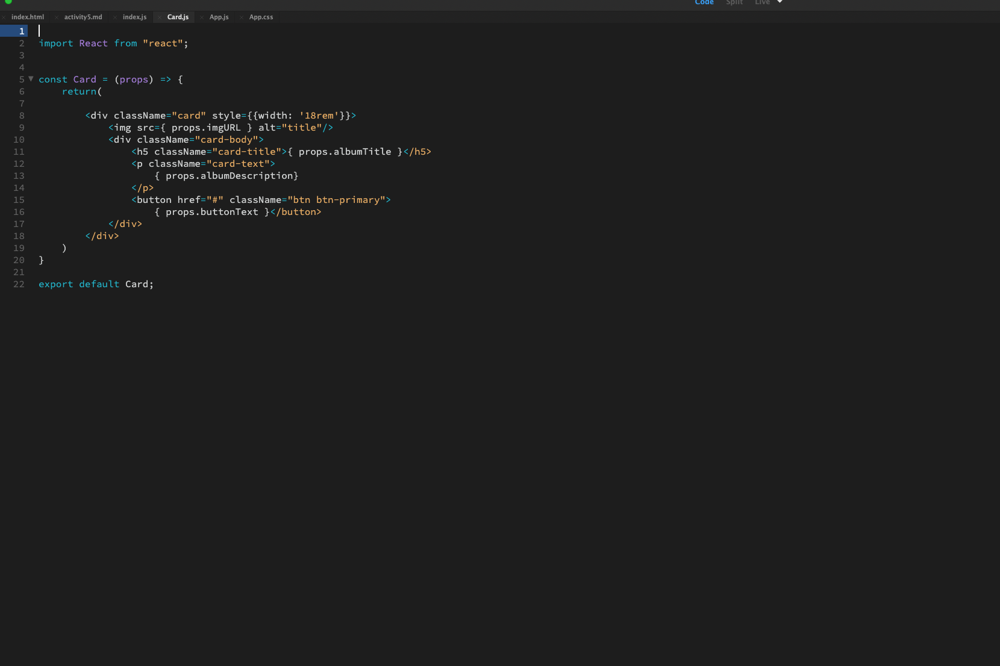
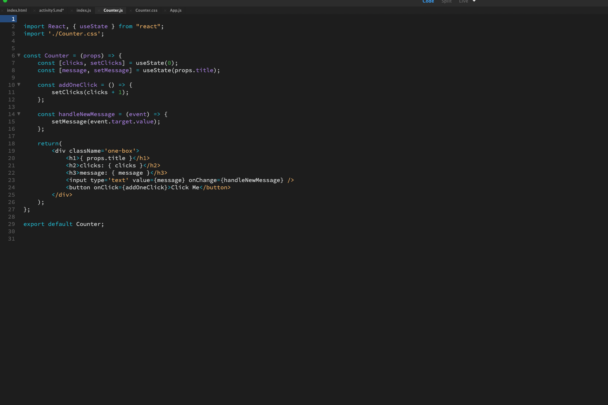
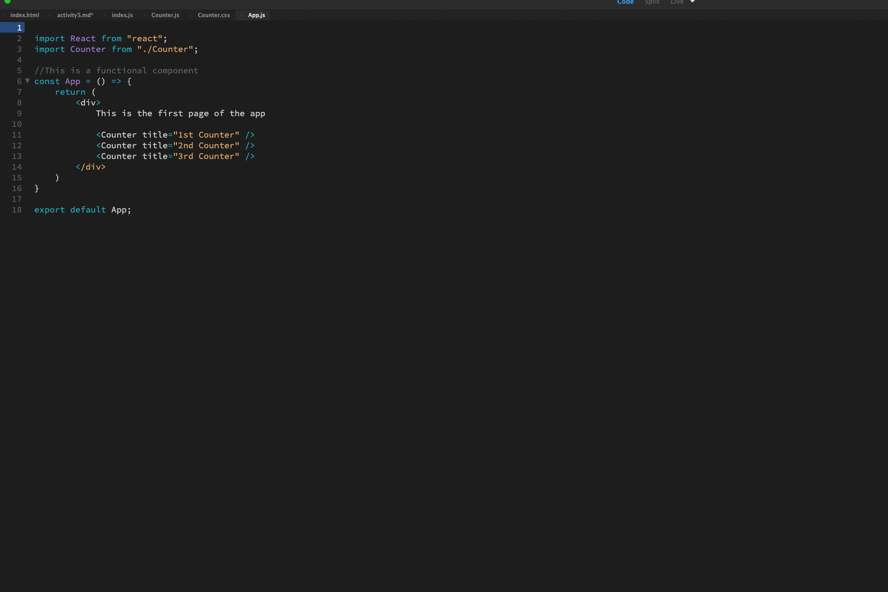
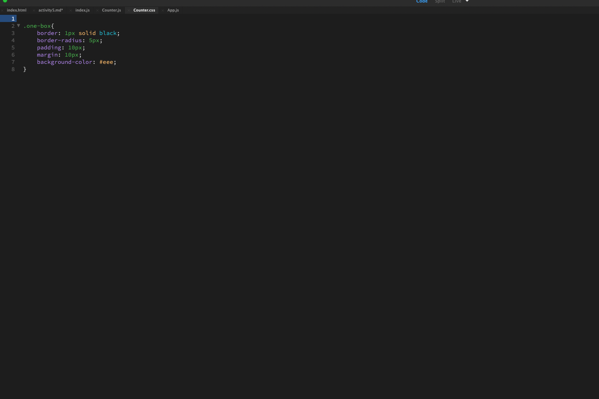

# Activity-5: React Music Application

## Executive Summary

### Part 1: React Music App
This section describes the construction of a music application using React. Bootstrap "Card" components, enhanced with CSS from bootstrapcdn.com, were utilized. The primary files involved were App.js, Index.js, and Card.js. React was imported into each file. In Card.js, the card component from Bootstrap was adapted to accept properties by introducing a props parameter and using the `export default` method for accessibility. In App.js, the necessary components were imported, and card properties were meticulously populated with data. Index.js incorporated React and ReactDOM along with the App and Card components, utilizing ReactDOM.render to populate the web page with content.

#### Screenshots:
- **Main Application Interface:** Displaying the primary screen of the Music App developed with React.
  !
- **Bootstrap Card Integration:** Showcasing the addition of Bootstrap card components.
  
- **CSS Integration:** Demonstrating the application of CSS from bootstrapcdn.com.
  
- **Card.js Development:** Illustrating the enhancement of Card.js with three cards.
  
- **App.js Development:** Detailing the addition of album information in App.js.
  

### Mini App #1: State Changer Demo
This mini application serves as a tutorial on utilizing state, properties (props), and methods for updating the state within an application. It employs a function that accepts props and returns React elements. Hooks from React libraries are used to manage state changes, responding to user interactions such as mouse clicks or keystrokes, updating the user interface accordingly.

#### Screenshots:
- **Setting Up React:** Using the terminal with the npx create-react-app command.
  
- **Application Initialization:** Display after creation and start-up with npm start.
  
- **Counter.js Implementation:** Featuring addOneClick() methods for counting user clicks and handleNewMessage() for updating messages entered by users.
  

### Part 2: Utilizing State and Props in the Music Application
This part details the use of props, state, and event handlers to enhance and update the music app created in Part 1. In App.js, a constant state variable named `albumList` is introduced along with a `setAlbumList()` function for future updates. A `renderedList()` function is invoked in the return statement of App.js. It employs the `map()` function to iterate over the `albumList`, transforming elements into JSX using the Card component with defined props. Ultimately, `renderedList()` returns a visually arranged list of albums using the Card component.

#### Screenshots:
- **Displaying Albums:** Showing three albums of various artisit using the Card component from Bootstrap, supplemented with additional CSS.
  

