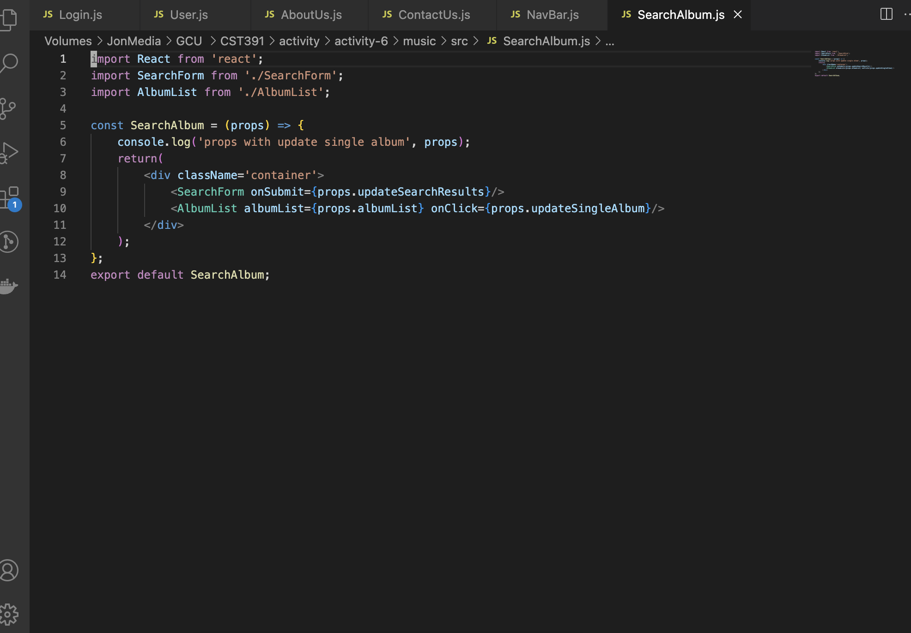

# Activity 6 React Music Application 

## Executive Summary

### Part 3 - External Data Source

In this activity, we extend the music app project from Activity 5. This is Part 3 of the activity, where we will use an external data source. The Express Music app will serve as our external data source. 

We will create a JSON file and import it into `App.js`. We use `useEffect` to provide an effect callback function, which React invokes during its lifecycle when it's safe to call functions that generate side effects, such as web service API calls. Additionally, we implement a search feature for albums based on their descriptions. This search functionality retrieves all albums containing specific word(s) in their description.

We use Axios, a popular library for fetching data from JSON-formatted REST services, to handle data retrieval. The `async` and `await` keywords are also employed to fetch data from slow external sources.

# Activity 6 Router App

This activity demonstrates how to handle protected routes where only authorized users can access certain pages. Here's a breakdown of how it works:

1. **Initial State**: The `isLoggedIn` state is initially set to `false`. While it is `false`, the `PrivateRoute` component redirects the user to the `LoginPage`.

2. **Login Process**:
   - The `LoginPage` component declares a `handleLogin` function.
   - This function sets the 'from' URL address location that a user was attempting to access before being redirected to the login page.
   - It then calls the `onClick` function passed from `App.js` via props: `props.onClick(from, navigate)`.

3. **App.js Interaction**:
   - The `props.onClick` function in `LoginPage` triggers an event in `App.js` and passes the location (`from`) along with the `navigate` function instantiated from `useNavigate()`.
   - The `handleLogin` function in `App.js` then fires, sets `isLoggedIn` to `true`, and reroutes the user to the URL they were trying to access before being redirected to the `LoginPage`.

4. **Navigation**:
   - This is accomplished with: `navigate(from, {replace: true})`.
   - The `navigate` function sends the user to the intended destination.
   - The `from` location is the URL sent over from the `LoginPage`.
   - The `replace: true` option removes the `LoginPage` redirect URL from the browser history, so the user doesn't go back to it if they use the browser's back button.

#### Screenshots:

- This screen shows the search bar location.

- This screen shows the search bar being filled with a search key, demonstrating that the console prints the search term letter by letter.

- This screen shows the console output indicating that the search value was accepted and assigned to a variable called `phrase`.

### Part 3 - Mini App #2 - Routing Application Demo

This application demonstrates the use of routing in the React library. A web application route connects the browser's URL to the web page's content. We create the app using the command `npx create-react-app router` and develop several components representing different pages.

In this part of the activity, `props.onClick` is used, called by `handleLogin`. We also use `Navigate`, a method that allows routing to navigate to the next application page, and `location` to get the location state.

#### Screenshots:

- This screen shows the main page of the routing app.

- This screen shows that the user cannot display the about page until they log in.

- This screen shows the user page of the routing app.

- This screen shows the login page.

- This screen shows the about page after the user has logged in.

- This screen shows the page when the user clicked on one of the friends' names.

### Part 4 - Navigation Routing

In this part of the activity, we use `react-router-dom`, which we install using `npm install react-router-dom`. Several changes are made to the application from the previous part, including implementing the search feature. Users can now search for albums using words in the album's description. 

We import and use components such as `BrowserRouter`, `Routes`, and `Route`. `BrowserRouter` is a wrapper component for router components, `Routes` is the parent component of individual routes, and `Route` defines an individual route in the application. New components such as `NewAlbum`, `OneAlbum`, `SearchAlbum`, and `NavBar` are added to the application.

#### Screenshots:

 
- This screen shows the final look of the music app with a search bar, allowing the user to search for albums using words in their descriptions.

- This screen shows the search process, where the user searches for albums from 1969, and the search results return two albums.

- This screen shows the new album page.

