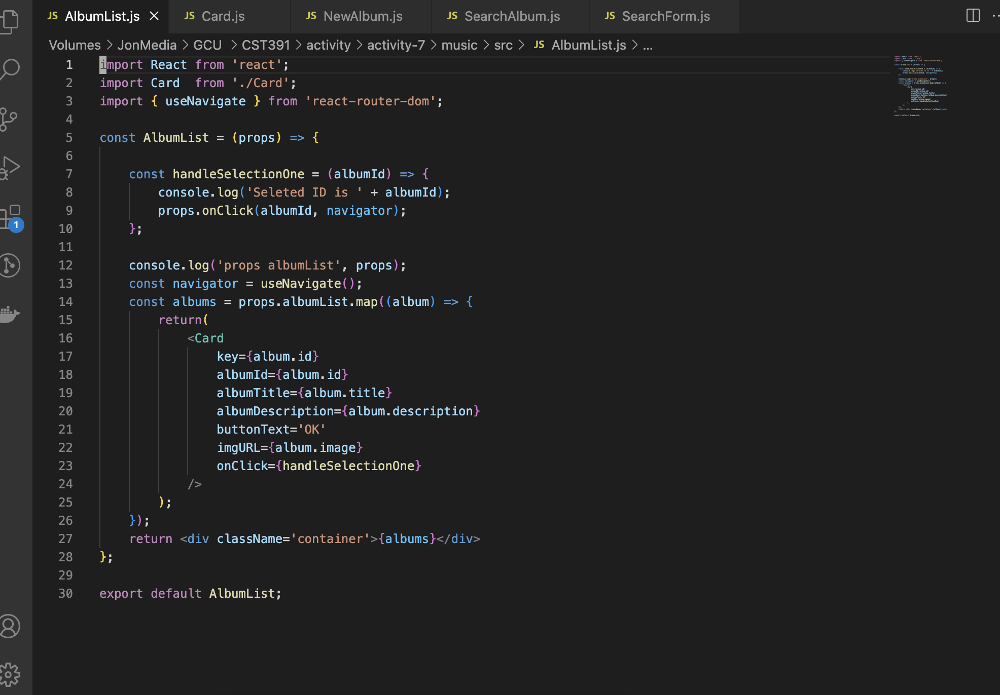
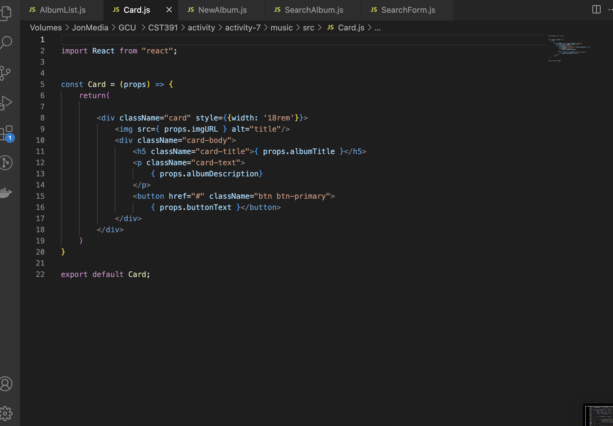
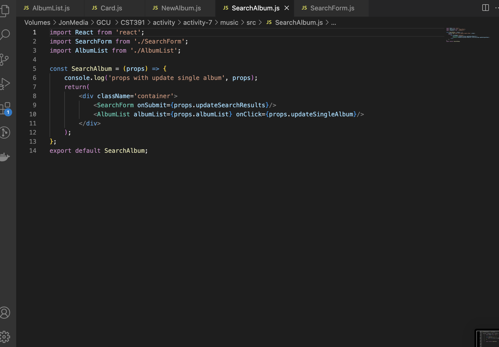

# Activity 7 React Music Application 

## Executive Summary

# Music App

In this activity, we are building on Activity 6 (which involved creating a music app). In this new part (Part 6), we have added the option to dynamically create a new album. We achieved this by using the `onChange` event to update the value of each property dynamically based on the input box value or text. When the submit button is clicked, the `handleFormSubmit()` function is called to create a new album, update its values, and add it to the database. Subsequently, the `onNewAlbum()` function is invoked in the parent component `App.js`, which reloads all the albums and redirects the user to the main page.

Moving on to Part 7 of the activity, we have upgraded the `NewAlbum` component to an `EditAlbum` component, which now serves the purpose of adding new albums and editing existing ones. We have implemented an if statement to check whether the album is new or already exists. If it is a new album, the placeholder value is displayed in the input fields; otherwise, the input fields are populated with the values of the existing album.

## Challenges

- I encountered difficulties in making Part 5 of this activity work.

## Pending Bugs

- The bug I have encountered is related to the album ID. For some reason, it only retrieves the first album in my database, and the album ID is defined as zero (localhost:3000/edit/0), while in my database, I do not have an album with an ID number of zero.
- The navbar fails to work as a dropdown list when the window is resized to a smaller size.
- After applying the search, the main link in the navbar does not respond and does not navigate the user to the main page.

## Potential Solutions and Next Steps

1. **Album ID Bug**:
   - Ensure that the album ID is correctly retrieved from the database. Double-check the database query to ensure the correct album ID is being passed to the `EditAlbum` component.
   - Add debugging logs to trace the flow of the album ID from the database to the component.
   - Verify that the routing logic correctly captures the album ID from the URL.

2. **Navbar Dropdown Issue**:
   - Implement responsive design techniques to ensure the navbar functions correctly on different screen sizes.
   - Use CSS media queries to style the navbar for smaller screens, enabling a dropdown menu.
   - Test the navbar on various screen sizes and devices to ensure consistent behavior.

3. **Search Navigation Bug**:
   - Review the navigation logic in the navbar and ensure that the search results do not interfere with the main link's functionality.
   - Verify that the search feature does not override or block the main navigation route.
   - Add event listeners or handlers to manage the navigation after a search is performed.

By rectifying these concerns, the music application can enhance its robustness and user-friendliness, facilitating a seamless experience for album creation, editing, and navigation. Addressing these issues can make the music app more robust and user-friendly, providing a seamless experience for creating, editing, and navigating through albums.

### Screenshots:

- Shows the main page that display all albums.

- Shows the process of adding a new album, after submiting the form will navigate the user to the main page.

- Shows the main page after adding a new album.

- T Shows the edit page when the user clicked the Edit buttom om album.

- Shows the search process.

- Shows the .env process.
