# Mile-4

## Executive Summary
Car Show API Application (Milestone 4)

- The Car Show API application, developed as part of Milestone 4, is built using Angular based on Activity 4. It integrates with MAMP and the Express framework to access and manage data stored in MAMP and MySQL Workbench while using hostinger as server for mysql, with Milestone 3 running alongside to provide data access.

## Database

- The database contains a single table called "cars," which includes a list of cars. The table fields are car ID, make, model, year, color, price and an image.

## Application

# Design Update

- The design has been updated from a pet store to a car show.
# UML
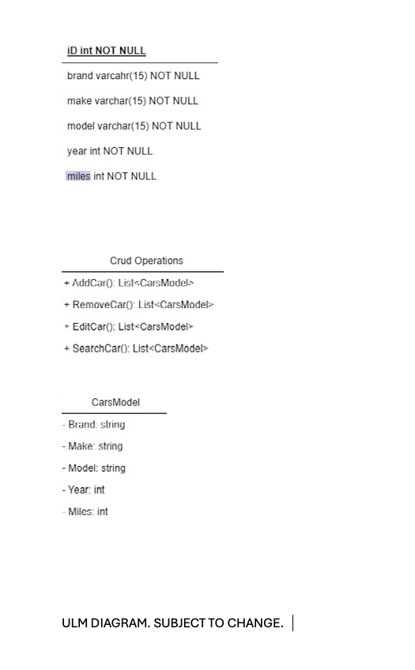
This is the new UML diagram.
# Challenges

- Constructor Error: One challenge was an error message indicating that the constructor was missing arguments. This issue arose because, in the create-car.component.ts, both Math.floor(Math.random() * 1000000) and carId were used. Identifying and correcting this took some time.

- Data Access: Another challenge was forgetting to run the Express build application (Milestone 3) to access data stored in MAMP.

# Pending Bugs

- There are no pending bugs.
# Lessons Learned

- Debugging is essential to identify and resolve errors.
Attention to detail and focus are crucial during coding to avoid mistakes.

#### Screenshots

Screenshots

- This screen shows the welcome message of the Car Show API when the user opens the web page.
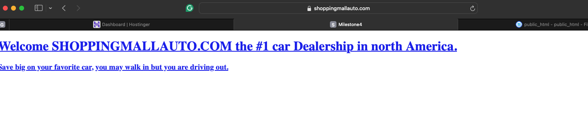

- This screen shows the cars list styled using Bootstrap.
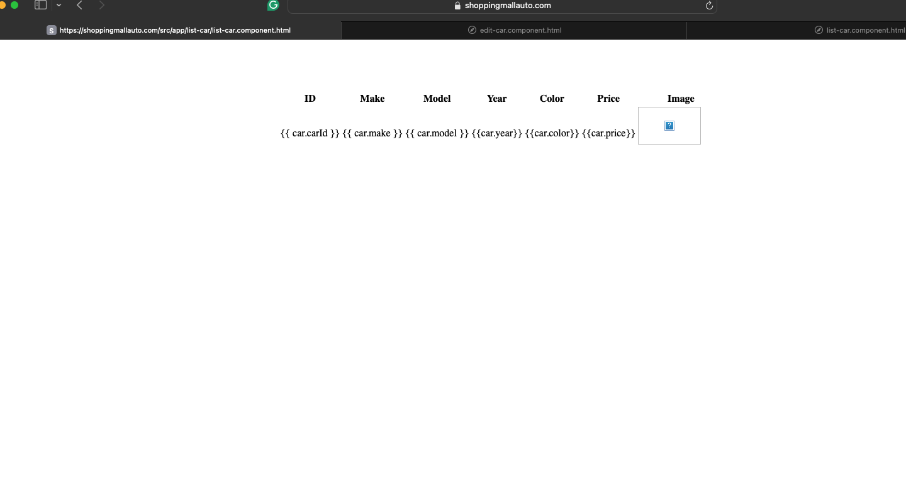

- This screen shows the add new car page, which is built using a form with Bootstrap.
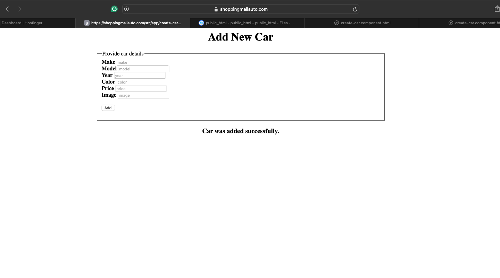

- This screen shows a message indicating that the car was added successfully.

- This screen shows the car list after adding a new car.

- This is the update page used to update an existing car in the list by using the car ID.
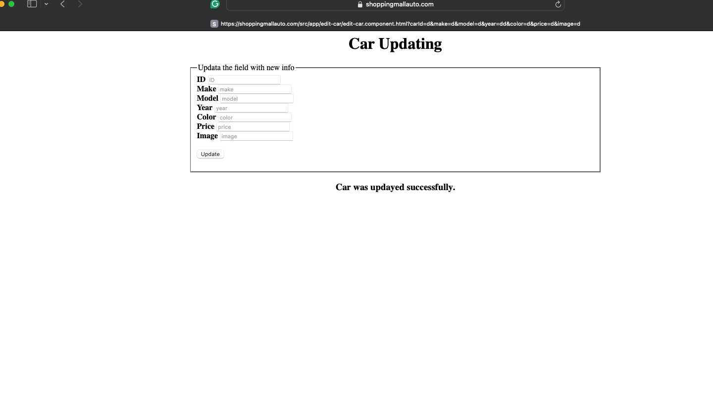

- This screen shows a message indicating that the car was updated successfully.

- This screen shows the remove car page, where a car can be removed by providing the ID and clicking the remove button.
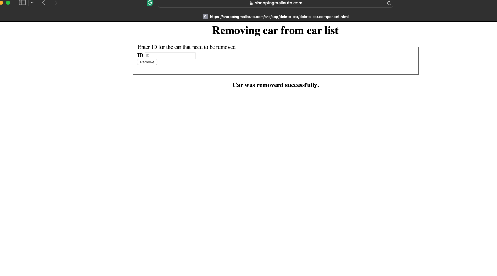

- This screen shows a message indicating that the car was removed successfully.

- This screen shows the car list after removing a car, where the last car was removed from the list.
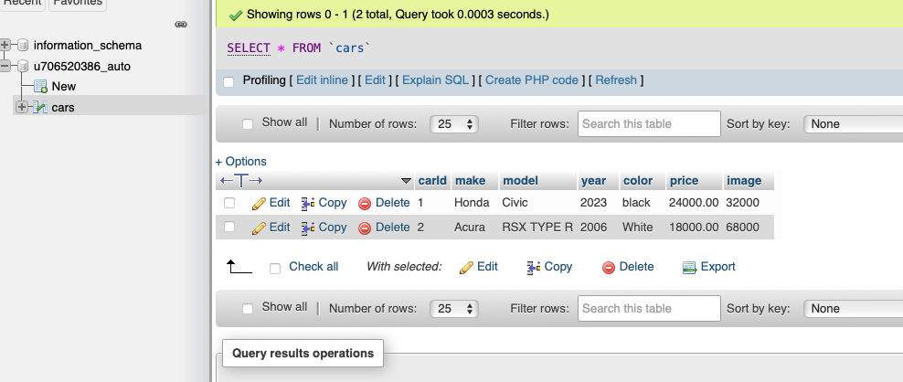

- These pictures show the database before and after adding a car to the database.
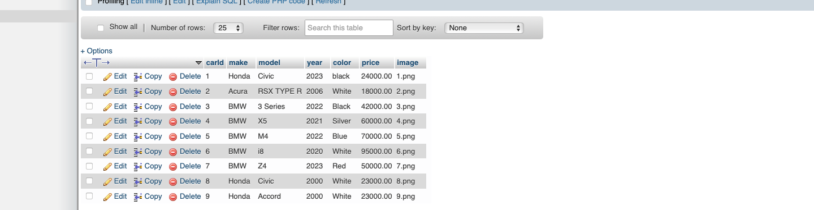

### Backend:

- This screen shows select all car from car's list.

- This screen shows select car by its ID.
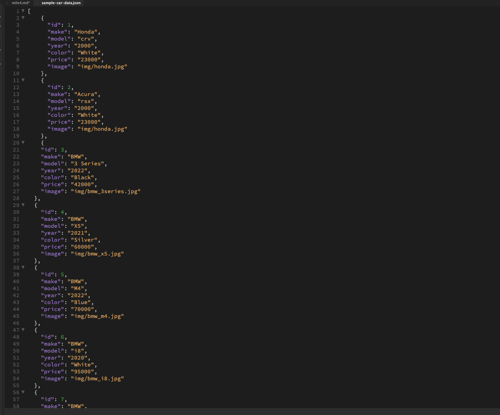

- This screen shows select cars by its make.
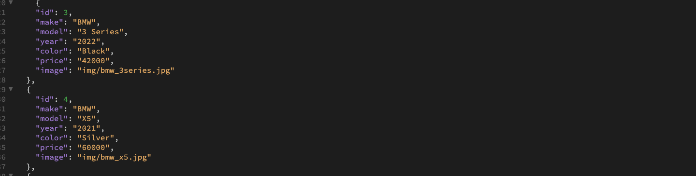

- This screen shows select cars by its model.
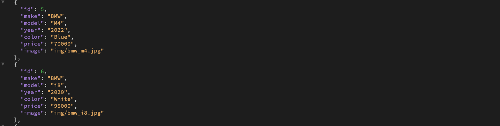

- This screen shows adding a new car to the table.
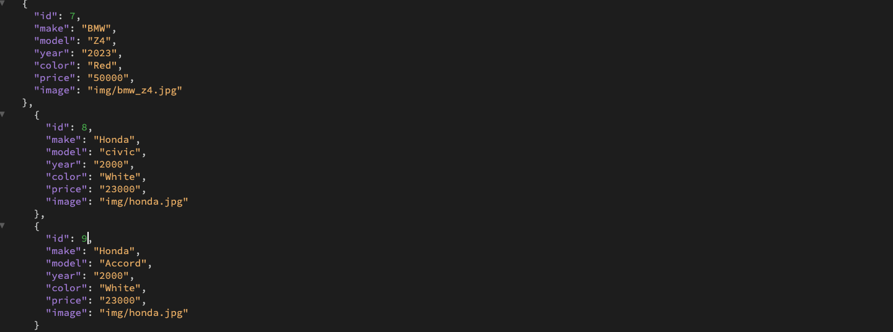

- This screen shows the update of one car using Id. Which the ford F-150 was replaced by ford fusion.
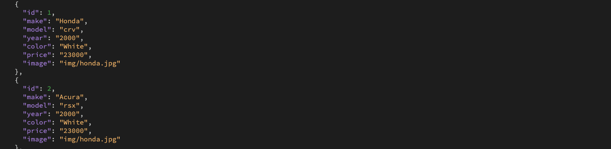

#### Recording:
    
- 
- This is the vidoe of the Car Show API while running showing the web pages and the postman.
GIT:
- gitlab: git@gitlab.com:cst3912/CST391.git

